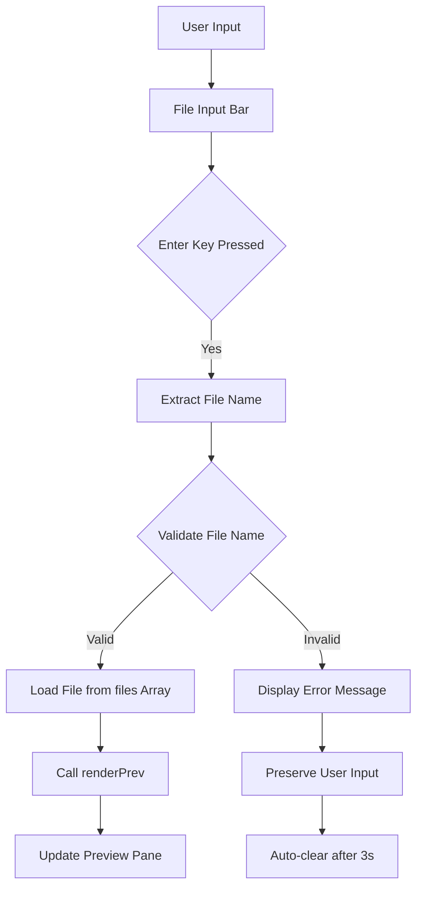

# Design Document: Browser File Navigation

## Overview

This design specifies the implementation of a browser-like file navigation feature for the Aether editor. The feature adds a URL-style input bar to the editor's topbar, enabling users to navigate between HTML files by typing file names. This enhances the user experience by providing quick access to any HTML file in the project without requiring manual selection from the file tree.

The implementation integrates seamlessly with the existing editor architecture, leveraging the current file management system (`files` array) and preview rendering mechanism (`renderPrev` function). The file navigator acts as an alternative navigation method that complements the existing file tree interface.

### Key Design Decisions

1. **Topbar Integration**: The file navigator is placed in the topbar next to the refresh button for easy access and visibility
2. **Minimal UI**: Uses a simple text input with a forward slash prefix to mimic browser URL bars
3. **Default Behavior**: Falls back to index.html when input is empty or whitespace-only
4. **Error Feedback**: Provides clear, temporary error messages for invalid file names
5. **Non-Intrusive**: Does not modify existing file management or preview rendering logic

## Architecture

### Component Structure

```
Topbar
├── Tabs (existing)
├── File Navigator (new)
│   ├── Forward Slash Prefix
│   └── File Input Bar
└── Actions (existing)
```

### Data Flow



### Integration Points

1. **Files Array**: The navigator reads from the existing `files` array to validate and load file content
2. **renderPrev Function**: Uses the existing `renderPrev(html)` function to display loaded files
3. **Topbar**: Adds new UI elements to the existing topbar structure
4. **Event System**: Integrates with the existing event binding system in `bindEvents()`

## Components and Interfaces

### File Navigator Component

The file navigator consists of HTML structure, styling, and JavaScript logic.

#### HTML Structure

```html
<div class="file-navigator">
  <span class="file-nav-prefix">/</span>
  <input 
    type="text" 
    class="file-nav-input" 
    id="file-nav-input"
    placeholder="index.html"
    maxlength="100"
  />
  <span class="file-nav-error" id="file-nav-error"></span>
</div>
```

#### CSS Styling

The file navigator uses styling consistent with the existing editor theme:

- Background: `#0a0a0a` (matches other topbar elements)
- Border: `1px solid var(--ed-border)` (consistent with editor borders)
- Border radius: `8px` (matches other input elements)
- Font: `var(--mono)` for the input field (consistent with file names)
- Font size: `12px` (matches other topbar text)
- Error color: `#ef4444` (red for error messages)

#### JavaScript Interface

```javascript
// Core Functions
function loadFileByName(fileName)
function validateFileName(fileName)
function showFileError(message)
function clearFileError()
function handleFileNavigation(event)

// Event Handlers
function onFileNavInput(event)
function onFileNavKeyPress(event)
```

### Function Specifications

#### `loadFileByName(fileName)`

**Purpose**: Loads and displays a file from the files array

**Parameters**:
- `fileName` (string): The name of the file to load

**Returns**: `boolean` - true if file loaded successfully, false otherwise

**Behavior**:
1. Trim whitespace from fileName
2. If empty or whitespace-only, use "index.html"
3. Validate fileName format and existence
4. If valid, retrieve file content using `getFileContent(fileName)`
5. Call `renderPrev(content)` to display the file
6. Return true on success

**Error Handling**:
- If file not found, call `showFileError("File not found")`
- If invalid format, call `showFileError("Invalid file format")`
- Return false on error

#### `validateFileName(fileName)`

**Purpose**: Validates that a file name is properly formatted and exists

**Parameters**:
- `fileName` (string): The file name to validate

**Returns**: `object` - `{ valid: boolean, error: string }`

**Validation Rules**:
1. Must end with `.html` extension
2. Must exist in the `files` array
3. Must not be empty after trimming

**Return Values**:
- `{ valid: true, error: null }` if valid
- `{ valid: false, error: "File not found" }` if file doesn't exist
- `{ valid: false, error: "Invalid file format. Use .html extension" }` if wrong format

#### `showFileError(message)`

**Purpose**: Displays an error message to the user

**Parameters**:
- `message` (string): The error message to display

**Behavior**:
1. Set error element text content to message
2. Add visible class to error element
3. Set timeout to auto-clear after 3000ms
4. Store timeout ID for potential early clearing

#### `clearFileError()`

**Purpose**: Clears any displayed error message

**Behavior**:
1. Clear timeout if exists
2. Remove visible class from error element
3. Clear error element text content

#### `handleFileNavigation(event)`

**Purpose**: Main event handler for Enter key press

**Parameters**:
- `event` (KeyboardEvent): The keyboard event

**Behavior**:
1. Check if Enter key was pressed
2. Get input value from file-nav-input element
3. Clear any existing errors
4. Call `loadFileByName(inputValue)`
5. If successful, optionally blur the input field

## Data Models

### File Object Structure

The navigator uses the existing file object structure from the `files` array:

```javascript
{
  name: string,      // File name including extension (e.g., "index.html")
  content: string    // HTML content of the file
}
```

### Error State

```javascript
{
  message: string,   // Error message to display
  timeoutId: number  // Timeout ID for auto-clearing
}
```

### Navigator State

The file navigator maintains minimal state:

```javascript
{
  currentFile: string,      // Currently displayed file name
  errorTimeoutId: number,   // Timeout ID for error auto-clear
  inputValue: string        // Current input field value
}
```


## Correctness Properties

*A property is a characteristic or behavior that should hold true across all valid executions of a system—essentially, a formal statement about what the system should do. Properties serve as the bridge between human-readable specifications and machine-verifiable correctness guarantees.*

### Property 1: Valid File Loading

*For any* HTML file that exists in the Project_Files array, when its name is entered in the File_Input_Bar and Enter is pressed, the File_Navigator should load that file's content and display it in the Preview_Pane.

**Validates: Requirements 2.1, 2.2, 2.4**

### Property 2: Enter Key Triggers Navigation

*For any* text value in the File_Input_Bar, when the Enter key is pressed while the input has focus, the File_Navigator should trigger the file loading operation (either loading a valid file or showing an error).

**Validates: Requirements 2.3**

### Property 3: Non-Existent File Error

*For any* file name that does not exist in Project_Files, when entered in the File_Input_Bar and Enter is pressed, the File_Navigator should display an error message indicating the file was not found.

**Validates: Requirements 4.1**

### Property 4: Invalid Format Error

*For any* file name that does not end with the .html extension, when entered in the File_Input_Bar and Enter is pressed, the File_Navigator should display an error message indicating invalid format.

**Validates: Requirements 4.2**

### Property 5: Input Preservation After Error

*For any* invalid input that triggers an error, the File_Input_Bar should preserve the user's input text after displaying the error message.

**Validates: Requirements 4.3**

### Property 6: Error Auto-Clear Timing

*For any* error message displayed by the File_Navigator, the error should remain visible for at least 3 seconds, and should be cleared when the user modifies the input.

**Validates: Requirements 4.4**

### Property 7: Refresh Button Integration

*For any* file loaded via the File_Navigator, when the refresh button is clicked, the Preview_Pane should reload the same file content.

**Validates: Requirements 5.1, 5.3**

### Property 8: Preview Rendering Integration

*For any* file loaded via the File_Navigator, the system should call the existing renderPrev function with the file's content, maintaining the iframe-based rendering behavior.

**Validates: Requirements 5.2**

### Property 9: Dynamic File List Access

*For any* modification to the Project_Files array (adding or removing files), the File_Navigator should immediately have access to the updated file list for validation and loading.

**Validates: Requirements 5.4**

### Property 10: Valid Character Input

*For any* string composed of alphanumeric characters, hyphens, underscores, and periods, the File_Input_Bar should accept and display these characters when typed.

**Validates: Requirements 6.1**

## Error Handling

### Error Types

1. **File Not Found Error**
   - Trigger: User enters a file name that doesn't exist in Project_Files
   - Message: "File not found"
   - Behavior: Display error, preserve input, auto-clear after 3s

2. **Invalid Format Error**
   - Trigger: User enters a file name without .html extension
   - Message: "Invalid file format. Use .html extension"
   - Behavior: Display error, preserve input, auto-clear after 3s

3. **Empty Input Handling**
   - Trigger: User presses Enter with empty or whitespace-only input
   - Behavior: Load index.html (no error shown)

### Error Display Strategy

Errors are displayed inline within the file navigator component:
- Position: Below or adjacent to the input field
- Styling: Red text (#ef4444) with small font size (11px)
- Duration: 3 seconds minimum, or until user types
- Non-blocking: Does not prevent further input

### Error Recovery

Users can recover from errors by:
1. Correcting the file name and pressing Enter again
2. Typing any character (auto-clears error)
3. Waiting 3 seconds (error auto-clears)
4. Clearing the input and pressing Enter (loads index.html)

### Edge Cases

1. **Rapid Enter Key Presses**: Debounce or ignore subsequent Enter presses while loading
2. **Case Sensitivity**: File names are case-sensitive (matches JavaScript array lookup)
3. **Whitespace Handling**: Trim leading/trailing whitespace before validation
4. **Special Characters**: Only alphanumeric, hyphens, underscores, and periods are allowed
5. **Missing index.html**: If index.html doesn't exist, show appropriate error

## Testing Strategy

### Dual Testing Approach

This feature requires both unit tests and property-based tests to ensure comprehensive coverage:

- **Unit tests** verify specific examples, edge cases, and error conditions
- **Property tests** verify universal properties across all inputs
- Together they provide comprehensive coverage: unit tests catch concrete bugs, property tests verify general correctness

### Unit Testing

Unit tests should focus on:

1. **Specific Examples**
   - Loading a known file (e.g., "about.html")
   - Displaying the forward slash prefix
   - Correct positioning in the topbar
   - Initial state showing index.html

2. **Edge Cases**
   - Empty input defaults to index.html
   - Whitespace-only input defaults to index.html
   - Missing index.html file
   - Very long file names (maxlength boundary)

3. **Error Conditions**
   - File not found error display
   - Invalid format error display
   - Error message auto-clear after 3 seconds
   - Error clear on user input

4. **Integration Points**
   - Refresh button still works after navigation
   - File tree and navigator stay in sync
   - Preview pane updates correctly

### Property-Based Testing

Property-based tests should be implemented using a JavaScript PBT library such as **fast-check** (recommended for JavaScript/TypeScript projects).

Each property test must:
- Run a minimum of 100 iterations
- Include a comment tag referencing the design property
- Tag format: `// Feature: browser-file-navigation, Property {number}: {property_text}`

**Property Test Specifications:**

1. **Property 1: Valid File Loading**
   - Generator: Create random files array with random HTML files
   - Test: For each file, enter its name and verify it loads
   - Assertion: Preview displays the correct file content
   - Tag: `// Feature: browser-file-navigation, Property 1: Valid File Loading`

2. **Property 2: Enter Key Triggers Navigation**
   - Generator: Random text strings
   - Test: Enter each string and press Enter
   - Assertion: Loading operation is triggered (success or error)
   - Tag: `// Feature: browser-file-navigation, Property 2: Enter Key Triggers Navigation`

3. **Property 3: Non-Existent File Error**
   - Generator: Random file names not in files array
   - Test: Enter each name and press Enter
   - Assertion: Error message "File not found" is displayed
   - Tag: `// Feature: browser-file-navigation, Property 3: Non-Existent File Error`

4. **Property 4: Invalid Format Error**
   - Generator: Random file names without .html extension
   - Test: Enter each name and press Enter
   - Assertion: Error message about invalid format is displayed
   - Tag: `// Feature: browser-file-navigation, Property 4: Invalid Format Error`

5. **Property 5: Input Preservation After Error**
   - Generator: Random invalid inputs
   - Test: Enter each input, trigger error
   - Assertion: Input field still contains the original text
   - Tag: `// Feature: browser-file-navigation, Property 5: Input Preservation After Error`

6. **Property 6: Error Auto-Clear Timing**
   - Generator: Random invalid inputs
   - Test: Trigger error, wait 3+ seconds
   - Assertion: Error message is cleared
   - Tag: `// Feature: browser-file-navigation, Property 6: Error Auto-Clear Timing`

7. **Property 7: Refresh Button Integration**
   - Generator: Random valid file names
   - Test: Load file via navigator, click refresh
   - Assertion: Same file is still displayed
   - Tag: `// Feature: browser-file-navigation, Property 7: Refresh Button Integration`

8. **Property 8: Preview Rendering Integration**
   - Generator: Random valid files
   - Test: Load file via navigator
   - Assertion: renderPrev is called with correct content
   - Tag: `// Feature: browser-file-navigation, Property 8: Preview Rendering Integration`

9. **Property 9: Dynamic File List Access**
   - Generator: Random file additions/removals
   - Test: Modify files array, attempt to load new file
   - Assertion: Navigator can access updated file list
   - Tag: `// Feature: browser-file-navigation, Property 9: Dynamic File List Access`

10. **Property 10: Valid Character Input**
    - Generator: Random strings with alphanumeric, hyphens, underscores, periods
    - Test: Type each string into input
    - Assertion: All characters are accepted and displayed
    - Tag: `// Feature: browser-file-navigation, Property 10: Valid Character Input`

### Test Environment Setup

Tests should:
- Mock the `files` array with test data
- Mock the `renderPrev` function to verify calls
- Use JSDOM or similar for DOM manipulation testing
- Simulate keyboard events (Enter key press)
- Use fake timers for testing auto-clear behavior

### Coverage Goals

- 100% coverage of new functions (loadFileByName, validateFileName, etc.)
- All error paths tested
- All integration points verified
- All 10 correctness properties validated with property-based tests
