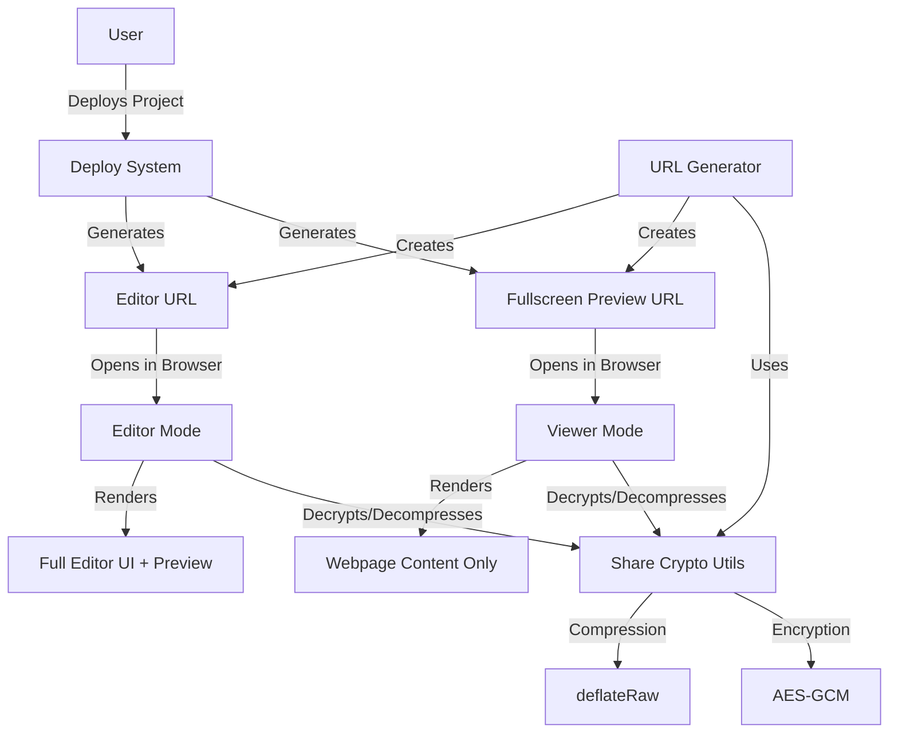
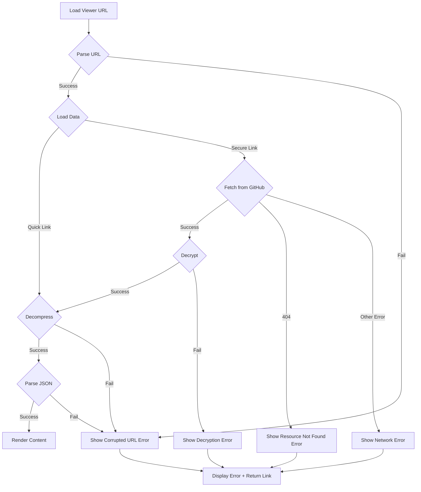

# Design Document: Fullscreen Preview URL

## Overview

This design document specifies the implementation of a fullscreen preview URL feature for Aether. The feature enables users to generate shareable URLs that display only the deployed webpage content without any editor UI elements, making it ideal for presentations and sharing final outputs.

The implementation extends Aether's existing share functionality (quick link and secure GitHub-based sharing) to support a viewer-only mode. When a fullscreen preview URL is opened, it renders the webpage in a dedicated viewer page that occupies the entire viewport without chat panels, code editors, tabs, or toolbars.

### Key Design Decisions

1. **Reuse Existing Infrastructure**: The feature leverages Aether's existing encryption, compression, and URL generation utilities to maintain consistency and reduce code duplication.

2. **URL Parameter Approach**: Fullscreen preview URLs use a query parameter (`?mode=viewer`) to distinguish them from standard editor URLs, allowing the same HTML page to serve both purposes.

3. **Minimal New Code**: The viewer functionality is implemented as a conditional rendering mode within the existing editor.html page rather than creating a separate viewer.html file.

4. **Dual URL Generation**: The deploy system generates both standard editor URLs and fullscreen preview URLs simultaneously, displaying them side-by-side in the deploy panel.

## Architecture

### Component Overview



### URL Format Specifications

#### Quick Link Format (Hash-based)
- **Editor URL**: `https://domain/editor.html#v1:{compressed_data}`
- **Fullscreen Preview URL**: `https://domain/editor.html?mode=viewer#v1:{compressed_data}`

#### Secure Link Format (GitHub-based)
- **Editor URL**: `https://domain/editor.html?src={github_url}#key={encryption_key}`
- **Fullscreen Preview URL**: `https://domain/editor.html?mode=viewer&src={github_url}#key={encryption_key}`

### Mode Detection Logic

The application detects viewer mode by checking for the `mode=viewer` query parameter:

```javascript
const urlParams = new URLSearchParams(window.location.search);
const isViewerMode = urlParams.get('mode') === 'viewer';
```

## Components and Interfaces

### 1. URL Generator Extension

**Location**: `aether-assets/share-crypto.js` (extend existing functions)

**New Functions**:

```javascript
/**
 * Creates a fullscreen preview URL using quick link format
 * @param {Array<{name: string, content: string}>} files - Project files
 * @returns {Promise<string>} Fullscreen preview URL
 */
export async function createQuickLinkViewer(files)

/**
 * Creates fullscreen preview URLs for both quick link and secure formats
 * @param {Array<{name: string, content: string}>} files - Project files
 * @returns {Promise<{editorUrl: string, viewerUrl: string}>} Both URL types
 */
export async function createViewerUrls(files)
```

**Implementation Strategy**:
- Reuse existing `createQuickLink()` and `createEncryptedSharePayload()` functions
- Append `?mode=viewer` query parameter to generated URLs
- Maintain backward compatibility with existing share functionality

### 2. Viewer Mode Renderer

**Location**: `aether-assets/app.js` (extend existing initialization)

**New Functions**:

```javascript
/**
 * Initializes the application in viewer mode
 * Hides all editor UI elements and renders only the preview
 */
function initViewer()

/**
 * Checks if the application should run in viewer mode
 * @returns {boolean} True if mode=viewer parameter is present
 */
function isViewerMode()
```

**Behavior**:
- Hide: chat panel, code editor, tabs, toolbars, file tree, all buttons
- Show: only the preview iframe, fullscreen
- Apply CSS to make iframe occupy 100% of viewport
- Disable all editor interactions

### 3. Deploy Panel UI Updates

**Location**: `editor.html` (Deploy tab section)

**New UI Elements**:

```html
<div class="card">
  <div style="color:#fff;margin-bottom:8px">Fullscreen Preview URL</div>
  <div style="font-size:12.5px;color:var(--t2);margin-bottom:10px">
    Share this URL to display only the webpage without editor UI
  </div>
  
  <!-- Quick Link Viewer URL -->
  <div class="deploy-url-row">
    <input class="deploy-url-input" id="viewer-quick-url" readonly value=""/>
    <button class="btn" onclick="copyViewerQuickUrl()">
      <svg data-lucide="copy"></svg> Copy
    </button>
  </div>
  
  <!-- Secure Link Viewer URL -->
  <div class="deploy-url-row" style="margin-top:8px">
    <input class="deploy-url-input" id="viewer-secure-url" readonly value=""/>
    <button class="btn" onclick="copyViewerSecureUrl()">
      <svg data-lucide="copy"></svg> Copy
    </button>
  </div>
</div>
```

**New Functions**:

```javascript
/**
 * Generates and displays fullscreen preview URLs in the deploy panel
 */
async function generateViewerUrls()

/**
 * Copies the quick link viewer URL to clipboard
 */
function copyViewerQuickUrl()

/**
 * Copies the secure viewer URL to clipboard
 */
function copyViewerSecureUrl()
```

### 4. Viewer Styling

**Location**: `editor.html` (add to existing `<style>` section)

**New CSS Classes**:

```css
/* Viewer mode styles */
body.viewer-mode {
  overflow: hidden;
}

body.viewer-mode .app-hdr,
body.viewer-mode .chat,
body.viewer-mode .topbar,
body.viewer-mode .runbar,
body.viewer-mode .files,
body.viewer-mode .editor,
body.viewer-mode .pane-code,
body.viewer-mode .pane-panel {
  display: none !important;
}

body.viewer-mode .workspace {
  flex-direction: column;
}

body.viewer-mode .surface {
  flex: 1;
  display: flex;
  flex-direction: column;
}

body.viewer-mode .main {
  flex: 1;
}

body.viewer-mode .pane-preview {
  flex: 1;
  padding: 0;
}

body.viewer-mode .preview-card {
  border-radius: 0;
  border: none;
}

body.viewer-mode .pframe {
  display: block !important;
  width: 100%;
  height: 100%;
}

body.viewer-mode .prev-empty {
  display: none !important;
}
```

## Data Models

### URL Structure

```typescript
interface ViewerUrl {
  mode: 'viewer';           // Query parameter to trigger viewer mode
  format: 'quick' | 'secure'; // URL format type
  data?: string;            // Compressed project data (quick link only)
  src?: string;             // GitHub URL (secure link only)
  key?: string;             // Encryption key (secure link only)
}
```

### Project Data Package

The existing project data structure is reused without modification:

```typescript
interface ProjectPackage {
  v: 1;                     // Version number
  files: {
    [filename: string]: string; // File content by name
  };
}
```

## Correctness Properties

*A property is a characteristic or behavior that should hold true across all valid executions of a system—essentially, a formal statement about what the system should do. Properties serve as the bridge between human-readable specifications and machine-verifiable correctness guarantees.*

### Property 1: Fullscreen URL Data Completeness

*For any* project with files, when a fullscreen preview URL is generated, extracting and decoding the data from that URL should yield project data equivalent to the original files.

**Validates: Requirements 1.2**

### Property 2: Viewer Mode UI Isolation

*For any* fullscreen preview URL, when opened in a browser, the rendered page should contain only the webpage content iframe and no editor UI elements (chat panel, code editor, tabs, toolbars, file tree).

**Validates: Requirements 2.1, 2.2, 2.3**

### Property 3: Multi-file Reference Resolution

*For any* project with multiple files containing cross-file references (CSS links, script tags), when rendered in viewer mode, all file references should resolve correctly and the content should display as intended.

**Validates: Requirements 2.4**

### Property 4: Quick Link Round-trip Preservation

*For any* project data, creating a hash-based fullscreen preview URL and then loading it should render webpage content equivalent to the original project's index.html.

**Validates: Requirements 3.1, 3.3**

### Property 5: Secure Link Round-trip Preservation

*For any* project data, creating a GitHub-based fullscreen preview URL and then loading it should render webpage content equivalent to the original project's index.html.

**Validates: Requirements 3.2, 3.4**

### Property 6: URL Format Consistency

*For any* fullscreen preview URL (quick or secure), it should use the same encryption and compression algorithms as the corresponding editor URL, differing only in the presence of the `mode=viewer` query parameter.

**Validates: Requirements 5.1, 5.2, 5.3**

### Property 7: URL Synchronization

*For any* project data update, when both editor and fullscreen preview URLs are regenerated, both should contain the updated project data and produce equivalent rendered output.

**Validates: Requirements 5.4**

### Property 8: Sandbox Security Consistency

*For any* webpage content rendered in viewer mode, the iframe sandbox restrictions should be identical to those applied in the editor's preview iframe.

**Validates: Requirements 7.4**

## Error Handling

### Error Scenarios and Responses

1. **Invalid or Corrupted URL Data**
   - **Detection**: Decompression or JSON parsing fails
   - **Response**: Display error message: "Unable to load preview. The URL may be corrupted or incomplete."
   - **Recovery**: Provide link to return to main Aether application

2. **Missing GitHub Resource**
   - **Detection**: HTTP 404 when fetching from GitHub URL
   - **Response**: Display error message: "Preview not found. The shared resource may have been deleted."
   - **Recovery**: Provide link to return to main Aether application

3. **Decryption Failure**
   - **Detection**: Crypto operation throws error or key is missing
   - **Response**: Display error message: "Unable to decrypt preview. The URL may be incomplete or invalid."
   - **Recovery**: Provide link to return to main Aether application

4. **Clipboard Operation Failure**
   - **Detection**: `navigator.clipboard.writeText()` rejects
   - **Response**: Display toast message: "Failed to copy URL. Please copy manually."
   - **Fallback**: Keep URL visible in input field for manual copying

### Error Display Component

```html
<div id="viewer-error" class="viewer-error" style="display:none">
  <div class="viewer-error-content">
    <svg data-lucide="alert-circle" width="48" height="48"></svg>
    <h2 id="viewer-error-title">Unable to Load Preview</h2>
    <p id="viewer-error-message"></p>
    <a href="index.html" class="btn">Return to Aether</a>
  </div>
</div>
```

### Error Handling Flow



## Testing Strategy

### Dual Testing Approach

This feature requires both unit tests and property-based tests for comprehensive coverage:

- **Unit tests**: Verify specific examples, edge cases, and error conditions
- **Property tests**: Verify universal properties across all inputs
- Both approaches are complementary and necessary

### Unit Testing Focus

Unit tests should cover:

1. **Specific URL Generation Examples**
   - Generate viewer URL for a simple single-file project
   - Generate viewer URL for a multi-file project
   - Verify `mode=viewer` parameter is present in generated URLs

2. **UI Element Visibility**
   - Verify editor UI elements are hidden in viewer mode
   - Verify preview iframe is visible and fullscreen in viewer mode
   - Verify error display appears for invalid URLs

3. **User Interactions**
   - Click copy button and verify clipboard contains viewer URL
   - Click copy button with clipboard failure and verify error toast
   - Load viewer URL and verify JavaScript executes in preview
   - Load viewer URL with forms and verify interactions work

4. **Error Conditions**
   - Load URL with corrupted data and verify error message
   - Load URL with missing GitHub resource and verify 404 error message
   - Load URL with invalid decryption key and verify decryption error message

### Property-Based Testing Configuration

- **Library**: Use `fast-check` for JavaScript property-based testing
- **Iterations**: Minimum 100 iterations per property test
- **Tagging**: Each test must reference its design document property

Property tests should cover:

1. **Property 1: Fullscreen URL Data Completeness**
   ```javascript
   // Feature: fullscreen-preview-url, Property 1: Fullscreen URL Data Completeness
   // For any project with files, extracting data from generated fullscreen URL
   // should yield equivalent project data
   ```

2. **Property 2: Viewer Mode UI Isolation**
   ```javascript
   // Feature: fullscreen-preview-url, Property 2: Viewer Mode UI Isolation
   // For any fullscreen preview URL, rendered page should contain only
   // webpage content iframe and no editor UI elements
   ```

3. **Property 3: Multi-file Reference Resolution**
   ```javascript
   // Feature: fullscreen-preview-url, Property 3: Multi-file Reference Resolution
   // For any project with cross-file references, viewer mode should resolve
   // all references correctly
   ```

4. **Property 4: Quick Link Round-trip Preservation**
   ```javascript
   // Feature: fullscreen-preview-url, Property 4: Quick Link Round-trip Preservation
   // For any project data, hash-based fullscreen URL should render content
   // equivalent to original
   ```

5. **Property 5: Secure Link Round-trip Preservation**
   ```javascript
   // Feature: fullscreen-preview-url, Property 5: Secure Link Round-trip Preservation
   // For any project data, GitHub-based fullscreen URL should render content
   // equivalent to original
   ```

6. **Property 6: URL Format Consistency**
   ```javascript
   // Feature: fullscreen-preview-url, Property 6: URL Format Consistency
   // For any fullscreen preview URL, it should use same encryption/compression
   // as editor URL, differing only in mode parameter
   ```

7. **Property 7: URL Synchronization**
   ```javascript
   // Feature: fullscreen-preview-url, Property 7: URL Synchronization
   // For any project data update, regenerated editor and viewer URLs should
   // contain updated data
   ```

8. **Property 8: Sandbox Security Consistency**
   ```javascript
   // Feature: fullscreen-preview-url, Property 8: Sandbox Security Consistency
   // For any webpage content in viewer mode, iframe sandbox restrictions
   // should match editor preview iframe
   ```

### Test Data Generators

For property-based tests, implement generators for:

- **Random project files**: Generate projects with 1-10 files of varying content
- **Random HTML with references**: Generate HTML with CSS/JS links to other files
- **Random file names**: Generate valid file names with various extensions
- **Random content**: Generate text, HTML, CSS, and JavaScript content

### Integration Testing

1. **End-to-End Viewer Flow**
   - Create project → Generate viewer URL → Open in new tab → Verify content displays
   - Create project → Deploy → Copy viewer URL → Open in incognito → Verify content displays

2. **Cross-Browser Testing**
   - Test viewer mode in Chrome, Firefox, Safari, Edge
   - Verify iframe rendering is consistent across browsers
   - Verify clipboard operations work in all browsers

3. **URL Length Testing**
   - Test quick link viewer URLs with maximum size projects
   - Verify URL length limits don't break functionality
   - Test fallback to secure links for large projects

### Performance Testing

1. **Load Time**: Measure time to decompress and render viewer content
2. **Memory Usage**: Verify viewer mode doesn't leak memory
3. **Large Projects**: Test viewer with projects containing many files or large files

### Security Testing

1. **Sandbox Verification**: Confirm iframe sandbox prevents malicious actions
2. **XSS Prevention**: Test that user content cannot escape iframe
3. **Encryption Strength**: Verify AES-GCM encryption is properly implemented
