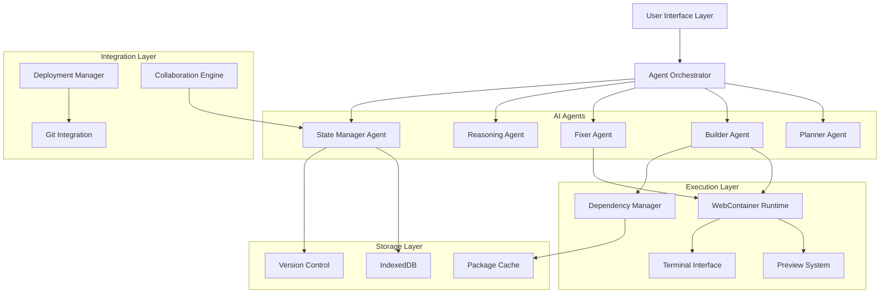
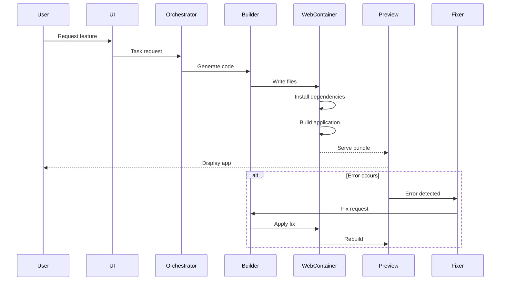

# Design Document: Aether Platform Enhancement

## Overview

This design transforms Aether from a simulated web app builder into a production-grade AI-powered development platform. The core architectural shift replaces simulated execution with real WebContainer-based runtime, adds true dependency management, implements live bundling with HMR, and introduces professional deployment capabilities.

The design maintains Aether's free-to-use model by leveraging:
- WebContainer API (free for open-source projects)
- DUB5 AI (free external API)
- Browser-based execution (no server costs)
- Client-side storage (IndexedDB)
- OAuth-based deployment (user's own accounts)

Key architectural principles:
1. **Browser-native execution**: All code runs in the browser using WebContainers
2. **Zero backend costs**: No server infrastructure required
3. **Progressive enhancement**: Features work offline where possible
4. **Agent orchestration**: Multi-agent system coordinates complex workflows
5. **Real-time feedback**: Immediate error detection and auto-fixing

## Architecture

### High-Level Architecture



### Component Interaction Flow



## Components and Interfaces

### 1. WebContainer Runtime Manager

**Purpose**: Manages the WebContainer instance lifecycle and provides a unified interface for code execution.

**Key Responsibilities**:
- Initialize and maintain WebContainer instance
- Manage file system operations
- Execute shell commands
- Handle process lifecycle
- Provide streaming output

**Interface**:
```typescript
interface WebContainerManager {
  // Lifecycle
  initialize(): Promise<void>;
  dispose(): Promise<void>;
  
  // File operations
  writeFile(path: string, content: string): Promise<void>;
  readFile(path: string): Promise<string>;
  deleteFile(path: string): Promise<void>;
  listFiles(directory: string): Promise<FileNode[]>;
  
  // Process management
  spawn(command: string, args: string[]): Promise<WebContainerProcess>;
  exec(command: string): Promise<{ stdout: string; stderr: string; exitCode: number }>;
  
  // Server management
  on(event: 'server-ready', callback: (port: number, url: string) => void): void;
  on(event: 'error', callback: (error: Error) => void): void;
}

interface FileNode {
  name: string;
  type: 'file' | 'directory';
  path: string;
}

interface WebContainerProcess {
  output: ReadableStream<string>;
  input: WritableStream<string>;
  exit: Promise<number>;
  kill(): void;
}
```

**Implementation Notes**:
- Use `@webcontainer/api` package
- Implement singleton pattern for WebContainer instance
- Cache file system state in memory for performance
- Handle WebContainer boot time (~2-3 seconds) with loading state

### 2. Dependency Manager

**Purpose**: Handles npm package installation, resolution, and caching within the WebContainer.

**Key Responsibilities**:
- Detect required dependencies from code
- Install packages using npm within WebContainer
- Manage package.json and package-lock.json
- Cache installed packages
- Handle dependency conflicts

**Interface**:
```typescript
interface DependencyManager {
  // Detection
  detectDependencies(code: string): Promise<string[]>;
  
  // Installation
  install(packages: string[]): Promise<InstallResult>;
  installAll(): Promise<InstallResult>;
  uninstall(packages: string[]): Promise<void>;
  
  // Package.json management
  updatePackageJson(dependencies: Record<string, string>): Promise<void>;
  getInstalledPackages(): Promise<Record<string, string>>;
  
  // Caching
  getCachedPackage(name: string, version: string): Promise<PackageCache | null>;
  cachePackage(name: string, version: string, files: FileTree): Promise<void>;
}

interface InstallResult {
  success: boolean;
  installedPackages: string[];
  errors: string[];
  logs: string[];
  duration: number;
}

interface PackageCache {
  name: string;
  version: string;
  files: FileTree;
  timestamp: number;
}

type FileTree = Record<string, { file: { contents: string } } | { directory: FileTree }>;
```

**Implementation Notes**:
- Use regex and AST parsing to detect imports
- Stream npm install output to UI in real-time
- Store package cache in IndexedDB with 7-day TTL
- Implement retry logic for network failures
- Support both npm and pnpm (faster)

### 3. Preview System with Live Bundling

**Purpose**: Provides live preview of the application with real bundling, HMR, and error overlays.

**Key Responsibilities**:
- Run development server within WebContainer
- Serve bundled application
- Apply hot module replacement
- Display build errors and runtime errors
- Support multiple viewport sizes

**Interface**:
```typescript
interface PreviewSystem {
  // Server management
  startDevServer(entry: string): Promise<PreviewServer>;
  stopDevServer(): Promise<void>;
  restartDevServer(): Promise<void>;
  
  // Preview control
  setViewport(width: number, height: number): void;
  setDevicePreset(preset: DevicePreset): void;
  rotate(): void;
  refresh(): void;
  
  // Error handling
  on(event: 'build-error', callback: (error: BuildError) => void): void;
  on(event: 'runtime-error', callback: (error: RuntimeError) => void): void;
  on(event: 'ready', callback: (url: string) => void): void;
}

interface PreviewServer {
  url: string;
  port: number;
  status: 'starting' | 'ready' | 'error';
}

type DevicePreset = 'mobile' | 'tablet' | 'desktop' | 'custom';

interface BuildError {
  message: string;
  file: string;
  line: number;
  column: number;
  stack: string;
}

interface RuntimeError {
  message: string;
  stack: string;
  componentStack?: string;
}
```

**Implementation Notes**:
- Use Vite as the bundler (faster than Webpack)
- Configure Vite to run within WebContainer
- Implement error boundary for React apps
- Use iframe with sandbox attributes for isolation
- Inject error overlay script into preview

### 4. Fixer Agent with Real-Time Error Detection

**Purpose**: Automatically detects, analyzes, and fixes errors in real-time.

**Key Responsibilities**:
- Monitor build and runtime errors
- Analyze error context and root causes
- Generate fixes using AI
- Apply fixes and validate
- Track fix success rate

**Interface**:
```typescript
interface FixerAgent {
  // Error monitoring
  startMonitoring(): void;
  stopMonitoring(): void;
  
  // Error handling
  handleError(error: ApplicationError): Promise<FixResult>;
  
  // Fix generation
  generateFix(error: ApplicationError, context: CodeContext): Promise<Fix>;
  applyFix(fix: Fix): Promise<void>;
  validateFix(fix: Fix): Promise<boolean>;
  
  // Analytics
  getFixStats(): FixStatistics;
}

interface ApplicationError {
  type: 'build' | 'runtime' | 'type' | 'lint';
  message: string;
  file: string;
  line: number;
  column: number;
  stack: string;
  code?: string;
}

interface CodeContext {
  file: string;
  content: string;
  surroundingLines: string[];
  imports: string[];
  exports: string[];
}

interface Fix {
  description: string;
  changes: FileChange[];
  confidence: number;
}

interface FileChange {
  file: string;
  oldContent: string;
  newContent: string;
  diff: string;
}

interface FixResult {
  success: boolean;
  fix?: Fix;
  attempts: number;
  error?: string;
}

interface FixStatistics {
  totalErrors: number;
  fixedErrors: number;
  failedFixes: number;
  averageFixTime: number;
  successRate: number;
}
```

**Implementation Notes**:
- Use DUB5 AI for fix generation
- Implement exponential backoff for retries (max 3 attempts)
- Include full error context in AI prompt
- Validate fixes by re-running build/tests
- Log all fix attempts for debugging

### 5. Version Control System

**Purpose**: Provides Git-based version control with commit history, branching, and remote integration.

**Key Responsibilities**:
- Initialize Git repository
- Track file changes
- Create commits with messages
- Manage branches
- Integrate with GitHub/GitLab

**Interface**:
```typescript
interface VersionControl {
  // Repository management
  init(): Promise<void>;
  getStatus(): Promise<GitStatus>;
  
  // Commits
  commit(message: string, files: string[]): Promise<Commit>;
  getHistory(limit?: number): Promise<Commit[]>;
  getDiff(commitA: string, commitB: string): Promise<FileDiff[]>;
  
  // Branches
  createBranch(name: string): Promise<void>;
  switchBranch(name: string): Promise<void>;
  mergeBranch(source: string, target: string): Promise<MergeResult>;
  listBranches(): Promise<Branch[]>;
  
  // Remote operations
  addRemote(name: string, url: string): Promise<void>;
  push(remote: string, branch: string): Promise<void>;
  pull(remote: string, branch: string): Promise<void>;
  
  // Time travel
  checkout(commitHash: string): Promise<void>;
  revert(commitHash: string): Promise<void>;
}

interface GitStatus {
  branch: string;
  modified: string[];
  added: string[];
  deleted: string[];
  untracked: string[];
}

interface Commit {
  hash: string;
  message: string;
  author: string;
  timestamp: Date;
  files: string[];
}

interface FileDiff {
  file: string;
  additions: number;
  deletions: number;
  diff: string;
}

interface Branch {
  name: string;
  current: boolean;
  lastCommit: Commit;
}

interface MergeResult {
  success: boolean;
  conflicts: string[];
}
```

**Implementation Notes**:
- Use `isomorphic-git` for browser-based Git operations
- Store Git data in IndexedDB
- Implement auto-commit on significant changes
- Use GitHub OAuth for remote authentication
- Provide visual diff viewer in UI

### 6. Deployment Manager

**Purpose**: Handles deployment to production hosting platforms (Vercel, Netlify).

**Key Responsibilities**:
- Authenticate with hosting platforms
- Build production bundle
- Upload files and configuration
- Monitor deployment status
- Manage environment variables

**Interface**:
```typescript
interface DeploymentManager {
  // Platform authentication
  authenticateVercel(): Promise<AuthResult>;
  authenticateNetlify(): Promise<AuthResult>;
  
  // Deployment
  deploy(platform: Platform, config: DeployConfig): Promise<Deployment>;
  getDeploymentStatus(deploymentId: string): Promise<DeploymentStatus>;
  cancelDeployment(deploymentId: string): Promise<void>;
  
  // Environment variables
  setEnvVars(platform: Platform, vars: Record<string, string>): Promise<void>;
  getEnvVars(platform: Platform): Promise<Record<string, string>>;
  
  // Deployment history
  listDeployments(platform: Platform): Promise<Deployment[]>;
  rollback(deploymentId: string): Promise<void>;
}

interface AuthResult {
  success: boolean;
  token?: string;
  user?: { name: string; email: string };
  error?: string;
}

type Platform = 'vercel' | 'netlify';

interface DeployConfig {
  projectName: string;
  buildCommand: string;
  outputDirectory: string;
  envVars: Record<string, string>;
  framework?: string;
}

interface Deployment {
  id: string;
  platform: Platform;
  url: string;
  status: DeploymentStatus;
  createdAt: Date;
  logs: string[];
}

type DeploymentStatus = 'queued' | 'building' | 'deploying' | 'ready' | 'error' | 'canceled';
```

**Implementation Notes**:
- Use platform REST APIs (Vercel API, Netlify API)
- Implement OAuth flow in popup window
- Store tokens securely in IndexedDB (encrypted)
- Stream deployment logs in real-time
- Support custom domains configuration

### 7. Collaboration Engine

**Purpose**: Enables real-time collaborative editing with operational transformation.

**Key Responsibilities**:
- Generate shareable session URLs
- Synchronize code changes in real-time
- Display collaborator cursors and selections
- Resolve editing conflicts
- Manage session state

**Interface**:
```typescript
interface CollaborationEngine {
  // Session management
  createSession(): Promise<Session>;
  joinSession(sessionId: string): Promise<Session>;
  leaveSession(): Promise<void>;
  
  // Collaboration
  broadcastChange(change: EditorChange): Promise<void>;
  on(event: 'change', callback: (change: EditorChange, user: User) => void): void;
  on(event: 'cursor', callback: (cursor: CursorPosition, user: User) => void): void;
  on(event: 'user-joined', callback: (user: User) => void): void;
  on(event: 'user-left', callback: (userId: string) => void): void;
  
  // User management
  getActiveUsers(): User[];
  updateUserInfo(info: Partial<User>): Promise<void>;
}

interface Session {
  id: string;
  url: string;
  createdAt: Date;
  owner: User;
}

interface EditorChange {
  file: string;
  operation: 'insert' | 'delete' | 'replace';
  position: { line: number; column: number };
  content: string;
  timestamp: number;
}

interface CursorPosition {
  file: string;
  line: number;
  column: number;
  selection?: { start: Position; end: Position };
}

interface Position {
  line: number;
  column: number;
}

interface User {
  id: string;
  name: string;
  avatar: string;
  color: string;
}
```

**Implementation Notes**:
- Use WebRTC for peer-to-peer communication (no server costs)
- Implement operational transformation (OT) for conflict resolution
- Use PeerJS for simplified WebRTC setup
- Fall back to WebSocket relay if P2P fails
- Store session data in IndexedDB for persistence

### 8. Builder Agent with Component Library Intelligence

**Purpose**: Generates code with awareness of popular component libraries and best practices.

**Key Responsibilities**:
- Generate code using specified component libraries
- Maintain consistent patterns across files
- Follow framework conventions
- Implement accessibility standards
- Generate type-safe code

**Interface**:
```typescript
interface BuilderAgent {
  // Code generation
  generateComponent(spec: ComponentSpec): Promise<GeneratedCode>;
  generatePage(spec: PageSpec): Promise<GeneratedCode>;
  generateAPI(spec: APISpec): Promise<GeneratedCode>;
  
  // Refactoring
  refactorCode(request: RefactorRequest): Promise<RefactorResult>;
  extractComponent(selection: CodeSelection): Promise<GeneratedCode>;
  
  // Library integration
  setComponentLibrary(library: ComponentLibrary): void;
  getAvailableComponents(library: ComponentLibrary): Promise<Component[]>;
  
  // Code analysis
  analyzeCode(file: string): Promise<CodeAnalysis>;
  suggestImprovements(file: string): Promise<Improvement[]>;
}

interface ComponentSpec {
  name: string;
  description: string;
  props: PropDefinition[];
  state: StateDefinition[];
  library: ComponentLibrary;
}

interface PageSpec {
  route: string;
  description: string;
  components: string[];
  dataFetching?: DataFetchingSpec;
}

interface APISpec {
  endpoint: string;
  method: 'GET' | 'POST' | 'PUT' | 'DELETE' | 'PATCH';
  requestBody?: SchemaDefinition;
  responseBody: SchemaDefinition;
  authentication?: AuthSpec;
}

interface GeneratedCode {
  files: Record<string, string>;
  dependencies: string[];
  instructions: string;
}

interface RefactorRequest {
  type: 'rename' | 'extract' | 'inline' | 'move';
  target: string;
  newName?: string;
  destination?: string;
}

interface RefactorResult {
  changes: FileChange[];
  affectedFiles: string[];
}

type ComponentLibrary = 'shadcn' | 'radix' | 'mui' | 'chakra' | 'none';

interface Component {
  name: string;
  description: string;
  props: PropDefinition[];
  examples: string[];
}

interface PropDefinition {
  name: string;
  type: string;
  required: boolean;
  description: string;
}

interface CodeAnalysis {
  complexity: number;
  duplicates: CodeDuplicate[];
  issues: CodeIssue[];
  metrics: CodeMetrics;
}

interface Improvement {
  type: 'performance' | 'readability' | 'security' | 'accessibility';
  description: string;
  suggestion: string;
  priority: 'low' | 'medium' | 'high';
}
```

**Implementation Notes**:
- Maintain library-specific prompt templates
- Use AST parsing for accurate refactoring
- Implement multi-file analysis for cross-file refactoring
- Cache component library documentation
- Generate TypeScript by default

### 9. State Manager Agent

**Purpose**: Coordinates agent activities and maintains shared application state.

**Key Responsibilities**:
- Track project state across sessions
- Coordinate multi-agent workflows
- Persist state to IndexedDB
- Handle state synchronization
- Detect and resolve deadlocks

**Interface**:
```typescript
interface StateManager {
  // State management
  getState<T>(key: string): Promise<T | null>;
  setState<T>(key: string, value: T): Promise<void>;
  deleteState(key: string): Promise<void>;
  clearState(): Promise<void>;
  
  // Project state
  saveProject(project: Project): Promise<void>;
  loadProject(projectId: string): Promise<Project>;
  listProjects(): Promise<ProjectMetadata[]>;
  deleteProject(projectId: string): Promise<void>;
  
  // Agent coordination
  registerAgent(agent: Agent): void;
  requestTask(task: Task): Promise<TaskResult>;
  broadcastEvent(event: StateEvent): void;
  on(event: string, callback: (data: any) => void): void;
  
  // Persistence
  export(): Promise<Blob>;
  import(data: Blob): Promise<void>;
}

interface Project {
  id: string;
  name: string;
  description: string;
  files: Record<string, string>;
  dependencies: Record<string, string>;
  settings: ProjectSettings;
  createdAt: Date;
  updatedAt: Date;
}

interface ProjectMetadata {
  id: string;
  name: string;
  description: string;
  lastModified: Date;
  size: number;
}

interface Agent {
  name: string;
  capabilities: string[];
  execute(task: Task): Promise<TaskResult>;
}

interface Task {
  type: string;
  payload: any;
  priority: number;
  timeout?: number;
}

interface TaskResult {
  success: boolean;
  data?: any;
  error?: string;
}

interface StateEvent {
  type: string;
  payload: any;
  timestamp: Date;
}

interface ProjectSettings {
  framework: 'react' | 'vue' | 'svelte' | 'vanilla';
  language: 'typescript' | 'javascript';
  componentLibrary: ComponentLibrary;
  styling: 'tailwind' | 'css' | 'styled-components';
}
```

**Implementation Notes**:
- Use IndexedDB with Dexie.js wrapper
- Implement event emitter pattern for state changes
- Compress project data before storage
- Implement automatic backup every 5 minutes
- Use Web Workers for heavy state operations

## Data Models

### Project Structure

```typescript
interface ProjectData {
  // Metadata
  id: string;
  name: string;
  description: string;
  createdAt: Date;
  updatedAt: Date;
  
  // Files
  files: FileSystem;
  
  // Dependencies
  packageJson: PackageJson;
  lockFile: string;
  
  // Configuration
  settings: ProjectSettings;
  
  // Version control
  gitData: GitData;
  
  // Deployment
  deployments: DeploymentRecord[];
  
  // Collaboration
  sessionId?: string;
  collaborators: User[];
}

interface FileSystem {
  [path: string]: FileEntry;
}

interface FileEntry {
  content: string;
  type: 'file' | 'directory';
  lastModified: Date;
}

interface PackageJson {
  name: string;
  version: string;
  dependencies: Record<string, string>;
  devDependencies: Record<string, string>;
  scripts: Record<string, string>;
}

interface GitData {
  commits: Commit[];
  branches: Branch[];
  currentBranch: string;
  remotes: Remote[];
}

interface Remote {
  name: string;
  url: string;
}

interface DeploymentRecord {
  id: string;
  platform: Platform;
  url: string;
  status: DeploymentStatus;
  timestamp: Date;
}
```

### Error Tracking

```typescript
interface ErrorLog {
  id: string;
  projectId: string;
  error: ApplicationError;
  context: CodeContext;
  fix?: Fix;
  fixResult?: FixResult;
  timestamp: Date;
}

interface ErrorStatistics {
  projectId: string;
  totalErrors: number;
  errorsByType: Record<string, number>;
  fixSuccessRate: number;
  averageFixTime: number;
  commonErrors: Array<{ error: string; count: number }>;
}
```

### Cache Structure

```typescript
interface CacheEntry<T> {
  key: string;
  value: T;
  timestamp: Date;
  ttl: number;
  size: number;
}

interface PackageCacheEntry extends CacheEntry<FileTree> {
  packageName: string;
  version: string;
}

interface AICacheEntry extends CacheEntry<string> {
  prompt: string;
  response: string;
  model: string;
}
```

## Correctness Properties

*A property is a characteristic or behavior that should hold true across all valid executions of a system—essentially, a formal statement about what the system should do. Properties serve as the bridge between human-readable specifications and machine-verifiable correctness guarantees.*


### Property Reflection

After analyzing all acceptance criteria, several redundancies were identified:
- Properties 1.2 and 2.2 both test dependency installation (consolidated into Property 2)
- Properties 1.3 and 4.1 both test error capture (consolidated into Property 3)
- Properties 8.1, 8.2, 8.3 test different component libraries (combined into Property 8)
- Multiple properties test similar persistence behavior (consolidated where appropriate)

### Core Properties

**Property 1: WebContainer Execution Isolation**
*For any* two projects created in Aether, changes made to files in one project should never affect the files, dependencies, or runtime state of the other project.
**Validates: Requirements 1.5**

**Property 2: Dependency Installation Completeness**
*For any* generated code with import statements, when the Dependency_Manager detects and installs dependencies, all imported packages should be available in node_modules and the application should run without module resolution errors.
**Validates: Requirements 1.2, 2.1, 2.2**

**Property 3: Error Capture Completeness**
*For any* runtime error, build error, or type error that occurs, the system should capture the complete error message, stack trace, file location, and surrounding code context.
**Validates: Requirements 1.3, 4.1**

**Property 4: Node.js API Availability**
*For any* standard Node.js API (fs, path, http, etc.) used in generated code, the WebContainer should provide a working implementation that produces correct results.
**Validates: Requirements 1.4**

**Property 5: Package.json Synchronization**
*For any* sequence of dependency operations (install, uninstall, update), the package.json file should always accurately reflect the currently installed packages in node_modules.
**Validates: Requirements 2.5**

**Property 6: Installation Progress Streaming**
*For any* package installation operation, the Dependency_Manager should emit progress events that can be displayed to the user in real-time.
**Validates: Requirements 2.3**

**Property 7: Build Triggering on Changes**
*For any* code modification in a project file, the Preview_System should trigger a rebuild within 2 seconds and display the updated application or error overlay.
**Validates: Requirements 3.1, 14.6**

**Property 8: Preview Isolation**
*For any* successfully built application, the Preview_System should render it in an iframe with sandbox attributes that prevent access to parent window context.
**Validates: Requirements 3.2**

**Property 9: Hot Module Replacement Preservation**
*For any* code change that supports HMR (component updates, style changes), the Preview_System should update the preview without resetting application state or causing full page reload.
**Validates: Requirements 3.3**

**Property 10: Error Overlay Display**
*For any* build error or runtime error, the Preview_System should display an error overlay containing the error message, file location, and relevant code snippet.
**Validates: Requirements 3.4**

**Property 11: Viewport Dimension Accuracy**
*For any* viewport size setting (preset or custom), the preview iframe dimensions should match the specified width and height exactly.
**Validates: Requirements 3.5, 13.1, 13.3**

**Property 12: Network Request Handling**
*For any* HTTP request made by the previewed application, the request should complete successfully or fail with appropriate CORS/network errors, never silently fail.
**Validates: Requirements 3.6**

**Property 13: Fix Generation Timeliness**
*For any* captured error, the Fixer_Agent should generate a proposed fix within 10 seconds or report that it cannot fix the error.
**Validates: Requirements 4.2**

**Property 14: Automatic Fix Application**
*For any* generated fix, the Fixer_Agent should apply the code changes, trigger a rebuild, and verify the error no longer occurs.
**Validates: Requirements 4.3**

**Property 15: Type Error Detection**
*For any* TypeScript type error in the codebase, the Fixer_Agent should detect it during build time and propose a type-correct fix.
**Validates: Requirements 4.4**

**Property 16: Lint Error Fixing**
*For any* code style violation detected by the linter, the Fixer_Agent should generate a fix that resolves the violation while preserving functionality.
**Validates: Requirements 4.5**

**Property 17: Git Repository Initialization**
*For any* newly created project, the Version_Control should initialize a Git repository with an initial commit containing the project files.
**Validates: Requirements 5.1**

**Property 18: Commit Tracking**
*For any* code changes committed to the repository, the Version_Control should create a commit object with message, timestamp, author, and file diffs that can be retrieved later.
**Validates: Requirements 5.2**

**Property 19: Branch Operations**
*For any* branch creation, switch, or merge operation, the Version_Control should update the working directory to reflect the target branch's file state.
**Validates: Requirements 5.3**

**Property 20: Commit History Completeness**
*For any* project with commits, the Version_Control should display a complete chronological history showing all commits with their messages, timestamps, and changed files.
**Validates: Requirements 5.4**

**Property 21: Remote Synchronization**
*For any* push or pull operation with a remote repository, the Version_Control should synchronize commits bidirectionally without data loss.
**Validates: Requirements 5.5**

**Property 22: Deployment Log Streaming**
*For any* deployment in progress, the Deployment_Manager should stream real-time logs showing build steps, deployment progress, and any errors.
**Validates: Requirements 6.4**

**Property 23: Deployment URL Provision**
*For any* successful deployment, the Deployment_Manager should provide a live HTTPS URL where the application is accessible.
**Validates: Requirements 6.5**

**Property 24: Environment Variable Injection**
*For any* environment variables configured for a deployment, they should be available to the application at runtime via process.env.
**Validates: Requirements 6.7**

**Property 25: Database Code Generation**
*For any* request for database functionality, the Builder_Agent should generate code that includes Supabase client initialization, authentication setup, and type-safe query methods.
**Validates: Requirements 7.1, 7.2, 7.4**

**Property 26: Secure Credential Storage**
*For any* sensitive credentials (API keys, database URLs), the system should store them encrypted in IndexedDB and never expose them in generated code or logs.
**Validates: Requirements 7.3**

**Property 27: Database Error Fixing**
*For any* database connection error or query error, the Fixer_Agent should detect the error type and generate a fix addressing the specific issue (connection string, query syntax, etc.).
**Validates: Requirements 7.5**

**Property 28: Schema Migration Generation**
*For any* database schema change request, the Builder_Agent should generate migration code that creates or alters tables with proper column types and constraints.
**Validates: Requirements 7.6**

**Property 29: Component Library Consistency**
*For any* project using a specified component library (Shadcn, Radix, etc.), all generated UI components should use that library's components and patterns exclusively.
**Validates: Requirements 8.1, 8.2, 8.3, 8.5**

**Property 30: Import Completeness**
*For any* generated code using external components or utilities, the file should include all necessary import statements at the top.
**Validates: Requirements 8.4**

**Property 31: Design System Adherence**
*For any* project with a specified design system, all generated components should follow that system's naming conventions, prop patterns, and styling approaches.
**Validates: Requirements 8.6**

**Property 32: Refactoring Impact Analysis**
*For any* refactoring operation, the Builder_Agent should identify all files that will be affected before making any changes.
**Validates: Requirements 9.1**

**Property 33: Import Update Propagation**
*For any* code moved from file A to file B, all import statements in other files that referenced file A should be automatically updated to reference file B.
**Validates: Requirements 9.2**

**Property 34: Rename Propagation**
*For any* function, class, or variable renamed from oldName to newName, all references to oldName across all project files should be updated to newName.
**Validates: Requirements 9.3**

**Property 35: Module Boundary Preservation**
*For any* code extraction operation, the extracted code should be placed in a new file with proper exports, and the original file should import and use the extracted code.
**Validates: Requirements 9.4**

**Property 36: Duplicate Code Detection**
*For any* project with multiple files, the Builder_Agent should identify code blocks that appear in multiple locations with similar or identical logic.
**Validates: Requirements 9.5**

**Property 37: Post-Refactoring Validation**
*For any* completed refactoring operation, running the application and tests should produce the same results as before the refactoring.
**Validates: Requirements 9.6**

**Property 38: Version History Completeness**
*For any* project with code changes, the Version_Control should maintain a complete timeline showing every change with timestamp, author, and diff.
**Validates: Requirements 10.1**

**Property 39: Version Diff Accuracy**
*For any* two versions in the history, the displayed diff should show exactly which lines were added, removed, or modified between those versions.
**Validates: Requirements 10.2, 10.4**

**Property 40: Version Restoration Round-Trip**
*For any* historical version, restoring to that version and then viewing the current code should show exactly the same file contents as that historical version.
**Validates: Requirements 10.3**

**Property 41: Historical Preview Accuracy**
*For any* historical version, previewing the application at that version should render the same UI and behavior as when that version was current.
**Validates: Requirements 10.5**

**Property 42: History Persistence**
*For any* project with commit history, closing and reopening the browser should preserve the complete history with all commits and diffs.
**Validates: Requirements 10.6**

**Property 43: Session URL Uniqueness**
*For any* two collaboration sessions created, they should have different session IDs and URLs that don't collide.
**Validates: Requirements 11.1**

**Property 44: State Synchronization Consistency**
*For any* two users in the same collaboration session, changes made by one user should appear in the other user's editor within 100ms.
**Validates: Requirements 11.2, 11.6**

**Property 45: Cursor Position Display**
*For any* collaborator editing a file, their cursor position and selection should be visible to all other collaborators in that file.
**Validates: Requirements 11.3**

**Property 46: Operational Transformation Convergence**
*For any* two conflicting edits made simultaneously by different users, the Collaboration_Engine should merge them such that all users converge to the same final document state.
**Validates: Requirements 11.4**

**Property 47: Collaborator List Accuracy**
*For any* collaboration session, the displayed list of active collaborators should match the set of users currently connected to the session.
**Validates: Requirements 11.5**

**Property 48: Multi-Agent Coordination**
*For any* complex task requiring multiple agents, the State_Manager should execute agents in the correct order and pass context between them.
**Validates: Requirements 12.1**

**Property 49: Plan Execution Sequencing**
*For any* plan created by the Planner_Agent, the Builder_Agent should execute each step in order and report progress after each step.
**Validates: Requirements 12.2**

**Property 50: Automatic Validation After Build**
*For any* code generated by the Builder_Agent, the Fixer_Agent should automatically run validation and fix any detected issues.
**Validates: Requirements 12.3**

**Property 51: Root Cause Analysis Before Fixing**
*For any* error detected, the Reasoning_Agent should analyze the root cause before the Fixer_Agent attempts to apply a fix.
**Validates: Requirements 12.4**

**Property 52: Shared Context Accessibility**
*For any* agent in the system, it should be able to read and write to the shared context maintained by the State_Manager.
**Validates: Requirements 12.5**

**Property 53: Viewport Rotation Dimension Swap**
*For any* viewport with dimensions W×H, rotating the viewport should result in dimensions H×W while preserving application state.
**Validates: Requirements 13.4, 13.5**

**Property 54: Viewport Dimension Display**
*For any* current viewport setting, the UI should prominently display the current width and height values.
**Validates: Requirements 13.6**

**Property 55: Package Cache Hit**
*For any* package installed previously, installing it again should use the cached version and complete faster than the initial installation.
**Validates: Requirements 14.1**

**Property 56: Incremental Build Performance**
*For any* small code change (single line modification), the rebuild time should be significantly less than a full clean build.
**Validates: Requirements 14.2**

**Property 57: Project Switch State Preservation**
*For any* project being switched away from, its WebContainer state, terminal history, and preview state should be preserved and restored when switching back.
**Validates: Requirements 14.3**

**Property 58: Lazy Dependency Loading**
*For any* dependency listed in package.json, it should only be loaded into memory when code actually imports it.
**Validates: Requirements 14.4**

**Property 59: Memory Release on Idle**
*For any* project that has been idle for more than 5 minutes, the Execution_Engine should release unused memory and reduce resource consumption.
**Validates: Requirements 14.5**

**Property 60: Auto-Save Latency**
*For any* code change, the State_Manager should persist the change to IndexedDB within 1 second.
**Validates: Requirements 15.1**

**Property 61: Full State Persistence**
*For any* project, closing the browser and reopening should restore all files, dependencies, settings, terminal state, and preview state.
**Validates: Requirements 15.2**

**Property 62: Project Export/Import Round-Trip**
*For any* project, exporting to ZIP and then importing the ZIP should result in an identical project with all files, dependencies, and settings preserved.
**Validates: Requirements 15.4, 15.5**

**Property 63: Terminal Shell Availability**
*For any* project with WebContainer initialized, opening the terminal should provide a working shell that accepts commands and returns output.
**Validates: Requirements 16.1**

**Property 64: Command Execution Accuracy**
*For any* valid shell command entered in the terminal, the Execution_Engine should execute it and display the correct stdout, stderr, and exit code.
**Validates: Requirements 16.2**

**Property 65: NPM Script Execution**
*For any* script defined in package.json, running it via npm run should execute the script and display its output.
**Validates: Requirements 16.3**

**Property 66: Unix Command Support**
*For any* common Unix command (ls, cat, grep, pwd, etc.), the WebContainer shell should provide a working implementation.
**Validates: Requirements 16.4**

**Property 67: Background Process Persistence**
*For any* long-running process started in the terminal, it should continue running in the background even when the terminal is not focused.
**Validates: Requirements 16.5**

**Property 68: Process Termination on Signal**
*For any* running process, sending a termination signal (Ctrl+C) should stop the process and return control to the shell.
**Validates: Requirements 16.6**

**Property 69: Code Style Compliance**
*For any* generated code, it should pass linting checks for the appropriate style guide (Airbnb for JS, PEP 8 for Python, etc.).
**Validates: Requirements 17.1**

**Property 70: Error Handling Presence**
*For any* generated function that performs I/O, network requests, or external API calls, it should include try-catch blocks or error handling logic.
**Validates: Requirements 17.2**

**Property 71: TypeScript Strict Mode**
*For any* generated TypeScript code, it should compile successfully with strict mode enabled and have no type errors.
**Validates: Requirements 17.3**

**Property 72: Accessibility Attribute Presence**
*For any* generated HTML element that requires accessibility attributes (buttons, inputs, images), it should include appropriate ARIA labels and roles.
**Validates: Requirements 17.4**

**Property 73: Security Vulnerability Absence**
*For any* generated code, it should not contain common security vulnerabilities such as XSS, SQL injection, or insecure direct object references.
**Validates: Requirements 17.5**

**Property 74: Complexity-Based Refactoring**
*For any* generated function with cyclomatic complexity above 10, the Builder_Agent should refactor it into smaller functions with lower complexity.
**Validates: Requirements 17.6**

**Property 75: API Client Error Handling**
*For any* generated HTTP client code, it should include error handling for network failures, timeouts, and non-2xx status codes.
**Validates: Requirements 18.1**

**Property 76: API Key Secure Storage**
*For any* API key provided by the user, it should be stored in environment variables and never hardcoded in source files.
**Validates: Requirements 18.2**

**Property 77: Popular API Support**
*For any* request to integrate Stripe, OpenAI, Twilio, or SendGrid, the Builder_Agent should generate working client code with proper authentication.
**Validates: Requirements 18.3**

**Property 78: Network Retry Logic**
*For any* API request that fails with a transient error (timeout, 5xx), the Fixer_Agent should implement retry logic with exponential backoff.
**Validates: Requirements 18.4**

**Property 79: API Type Safety**
*For any* generated API client code, request and response types should be defined using TypeScript interfaces.
**Validates: Requirements 18.5**

**Property 80: Rate Limit Backoff**
*For any* API that returns rate limit errors (429), the generated code should implement exponential backoff before retrying.
**Validates: Requirements 18.6**

**Property 81: Unit Test Generation**
*For any* generated function or component, the Builder_Agent should generate corresponding unit tests using Vitest or Jest.
**Validates: Requirements 19.1**

**Property 82: Component Test Generation**
*For any* generated React component, the Builder_Agent should generate component tests using React Testing Library.
**Validates: Requirements 19.2**

**Property 83: Test Coverage Threshold**
*For any* generated test suite, it should achieve at least 80% code coverage for the critical paths of the application.
**Validates: Requirements 19.3**

**Property 84: Test Execution in WebContainer**
*For any* test suite, running tests in the WebContainer should execute all tests and display pass/fail results.
**Validates: Requirements 19.4**

**Property 85: Test Failure Fixing**
*For any* failing test, the Fixer_Agent should analyze the failure and either fix the code to pass the test or fix the test if it's incorrect.
**Validates: Requirements 19.5**

**Property 86: E2E Test Generation**
*For any* critical user flow, the Builder_Agent should generate end-to-end tests using Playwright that verify the flow works correctly.
**Validates: Requirements 19.6**

**Property 87: JSDoc Comment Presence**
*For any* generated public function or class, it should include JSDoc comments describing parameters, return values, and behavior.
**Validates: Requirements 20.1**

**Property 88: README Generation**
*For any* project, the Builder_Agent should generate a README.md containing project description, setup instructions, and usage examples.
**Validates: Requirements 20.2**

**Property 89: Complex Logic Documentation**
*For any* generated code with algorithmic complexity or non-obvious logic, it should include inline comments explaining the approach.
**Validates: Requirements 20.3**

**Property 90: API Endpoint Documentation**
*For any* generated backend API endpoint, the Builder_Agent should generate documentation showing the endpoint path, method, request body, response body, and examples.
**Validates: Requirements 20.4**

**Property 91: Component Props Documentation**
*For any* generated component using a component library, it should include documentation of all props with types and descriptions.
**Validates: Requirements 20.5**

**Property 92: Changelog Maintenance**
*For any* significant feature addition or change, the Builder_Agent should update CHANGELOG.md with an entry describing the change.
**Validates: Requirements 20.6**

## Error Handling

### Error Categories

1. **WebContainer Errors**
   - Boot failures: Retry with exponential backoff, max 3 attempts
   - File system errors: Validate paths and permissions before operations
   - Process spawn failures: Check command validity and resource availability

2. **Dependency Errors**
   - Network failures: Retry with exponential backoff, use cached packages when available
   - Version conflicts: Detect conflicts early and suggest resolutions
   - Installation timeouts: Set 60-second timeout, cancel and retry if exceeded

3. **Build Errors**
   - Syntax errors: Capture location and context, send to Fixer_Agent
   - Type errors: Run TypeScript compiler, extract error details
   - Module resolution: Check imports and installed packages

4. **Runtime Errors**
   - Uncaught exceptions: Install error boundary, capture stack traces
   - Network errors: Implement retry logic with backoff
   - State errors: Validate state transitions, rollback on failure

5. **Deployment Errors**
   - Authentication failures: Re-trigger OAuth flow
   - Build failures: Capture logs, suggest fixes
   - Network timeouts: Retry with longer timeout

6. **Collaboration Errors**
   - Connection failures: Fall back to WebSocket relay
   - Sync conflicts: Use operational transformation to resolve
   - Session expiry: Prompt user to rejoin

### Error Recovery Strategies

**Automatic Recovery**:
- Retry transient failures (network, timeouts) with exponential backoff
- Apply AI-generated fixes for code errors
- Rollback state changes on failure
- Use cached data when network unavailable

**User-Assisted Recovery**:
- Prompt for missing credentials or configuration
- Offer manual conflict resolution for complex merge conflicts
- Provide diagnostic information when automatic fixes fail
- Allow manual retry of failed operations

**Graceful Degradation**:
- Continue with cached packages if npm registry unavailable
- Disable collaboration features if WebRTC fails
- Use simulated terminal if WebContainer fails to boot
- Provide read-only mode if storage quota exceeded

## Testing Strategy

### Dual Testing Approach

The testing strategy employs both unit tests and property-based tests as complementary approaches:

**Unit Tests**: Focus on specific examples, edge cases, and integration points
- Specific error scenarios (empty input, invalid credentials)
- Integration between components (WebContainer ↔ Preview System)
- Edge cases (storage quota exceeded, network offline)
- User interaction flows (create project → add code → preview)

**Property-Based Tests**: Verify universal properties across all inputs
- Run minimum 100 iterations per property test
- Generate random inputs (code, dependencies, file structures)
- Verify properties hold for all generated inputs
- Tag each test with feature name and property number

### Property-Based Testing Configuration

**Library Selection**:
- TypeScript/JavaScript: Use `fast-check` library
- Python: Use `hypothesis` library
- Each test runs 100+ iterations with randomized inputs

**Test Tagging Format**:
```typescript
// Feature: aether-platform-enhancement, Property 2: Dependency Installation Completeness
test('dependency installation makes all imports available', async () => {
  await fc.assert(
    fc.asyncProperty(
      fc.array(fc.string()), // random import statements
      async (imports) => {
        // Test implementation
      }
    ),
    { numRuns: 100 }
  );
});
```

### Test Coverage Requirements

**Core Components** (90%+ coverage):
- WebContainer Manager
- Dependency Manager
- Preview System
- Fixer Agent
- Version Control
- State Manager

**Integration Points** (80%+ coverage):
- Agent coordination
- File system operations
- Build pipeline
- Deployment flow

**UI Components** (70%+ coverage):
- Editor interactions
- Terminal interface
- Preview controls
- Collaboration UI

### Testing Environments

**Local Development**:
- Run tests in Node.js environment
- Mock WebContainer API for faster execution
- Use in-memory storage instead of IndexedDB

**CI/CD Pipeline**:
- Run full test suite on every commit
- Use real WebContainer in integration tests
- Test across multiple browsers (Chrome, Firefox, Safari)

**Manual Testing**:
- Test deployment to real Vercel/Netlify accounts
- Verify collaboration with multiple users
- Test on different network conditions (slow, offline)

## Implementation Phases

### Phase 1: Core Execution Infrastructure (Weeks 1-3)
- Integrate WebContainer API
- Implement WebContainer Manager
- Build Dependency Manager with npm integration
- Create basic Preview System with Vite
- Implement file system operations

### Phase 2: Error Detection and Fixing (Weeks 4-5)
- Build Fixer Agent with DUB5 AI integration
- Implement error capture and context extraction
- Create fix generation and application pipeline
- Add error overlay to Preview System
- Implement retry logic and backoff strategies

### Phase 3: Version Control and History (Weeks 6-7)
- Integrate isomorphic-git
- Implement Version Control interface
- Build commit, branch, and merge functionality
- Create history viewer with diffs
- Add time travel and restoration features

### Phase 4: Deployment Integration (Week 8)
- Implement Vercel deployment with OAuth
- Implement Netlify deployment with OAuth
- Build deployment status monitoring
- Add environment variable management
- Create deployment history tracking

### Phase 5: Advanced Features (Weeks 9-11)
- Build Collaboration Engine with WebRTC
- Implement operational transformation
- Add database integration (Supabase)
- Enhance Builder Agent with component library intelligence
- Implement multi-file refactoring

### Phase 6: Performance and Polish (Weeks 12-13)
- Implement caching strategies
- Optimize build performance
- Add responsive preview modes
- Implement memory management
- Add testing infrastructure

### Phase 7: Documentation and Testing (Week 14)
- Generate comprehensive documentation
- Write property-based tests for all properties
- Write unit tests for edge cases
- Perform integration testing
- Conduct user acceptance testing

## Success Metrics

**Performance Metrics**:
- WebContainer boot time: < 3 seconds
- Dependency install time: < 30 seconds for typical project
- Rebuild time: < 2 seconds for small changes
- Fix generation time: < 10 seconds
- Auto-save latency: < 1 second

**Quality Metrics**:
- Fix success rate: > 80%
- Test coverage: > 85% for core components
- Error detection rate: > 95% of runtime errors captured
- Build success rate: > 90% of generated code builds successfully

**User Experience Metrics**:
- Time to first preview: < 10 seconds
- Collaboration latency: < 100ms
- Deployment success rate: > 95%
- Storage efficiency: < 50MB per typical project

## Future Enhancements

**Advanced AI Features**:
- Multi-modal input (design mockups → code)
- Voice-driven development
- Intelligent code suggestions
- Automated performance optimization

**Extended Platform Support**:
- Mobile app preview (iOS/Android simulators)
- Desktop app generation (Electron, Tauri)
- Backend framework support (Express, Fastify, NestJS)
- Database options (PostgreSQL, MongoDB, Redis)

**Enterprise Features**:
- Team workspaces with role-based access
- Private component libraries
- Custom deployment targets
- Audit logs and compliance reporting

**Developer Tools**:
- Visual debugging with breakpoints
- Performance profiling
- Bundle size analysis
- Accessibility auditing
