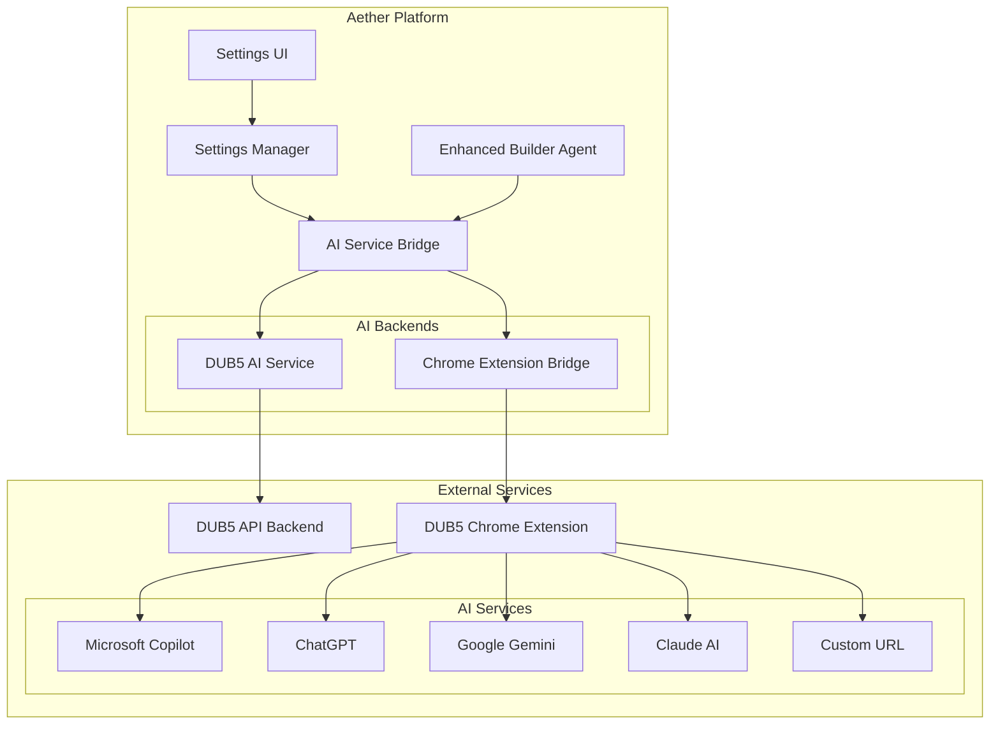

# Design Document: Dual AI Functionality Enhancement

## Overview

The Dual AI Functionality Enhancement extends the Aether platform to support two AI backends: the existing DUB5 AI Backend and a new Chrome Extension Bridge. This design maintains full backward compatibility while introducing a flexible AI service selection system that allows users to leverage popular AI services (Microsoft Copilot, ChatGPT, Google Gemini, Claude AI) through the DUB5 Chrome Extension.

The architecture implements a clean abstraction layer that allows seamless switching between AI backends without disrupting existing functionality. The Chrome Extension Bridge uses window.postMessage for secure communication, while the existing DUB5 backend continues to operate through its established API proxy.

### Key Design Principles

- **Backward Compatibility**: Existing DUB5 AI Backend functionality remains unchanged
- **Service Abstraction**: Common interface for both AI backends
- **Configuration Persistence**: User preferences stored in browser local storage
- **Error Resilience**: Graceful fallback mechanisms and clear error messaging
- **Extensibility**: Architecture supports future AI service additions

## Architecture

### System Components



### Communication Flow

1. **Settings Management**: User selects AI backend through Settings UI
2. **Service Routing**: AI Service Bridge routes requests to appropriate backend
3. **Backend Processing**: Selected backend processes AI requests
4. **Response Handling**: Responses are normalized and returned to the application

### Message Passing Protocol

The Chrome Extension Bridge uses a structured message passing system:

```typescript
// Query Message (Aether → Chrome Extension)
interface DUB5QueryMessage {
  type: 'DUB5_QUERY';
  prompt: string;
  serviceId: string;
  customUrl?: string;
  requestId: string;
}

// Response Message (Chrome Extension → Aether)
interface DUB5ResponseMessage {
  type: 'DUB5_RESPONSE';
  requestId: string;
  success: boolean;
  content?: string;
  error?: string;
}

// Service Info Query
interface ServiceInfoQuery {
  type: 'GET_SERVICE_INFO';
  requestId: string;
}

// Service Info Response
interface ServiceInfoResponse {
  type: 'SERVICE_INFO_RESPONSE';
  requestId: string;
  currentService: string;
  isConnected: boolean;
  availableServices: string[];
}
```

## Components and Interfaces

### Settings Manager

The Settings Manager handles user preferences and AI backend configuration:

```typescript
interface AIBackendSettings {
  selectedBackend: 'dub5' | 'chrome-extension';
  chromeExtension: {
    selectedService: 'copilot' | 'chatgpt' | 'gemini' | 'claude' | 'custom';
    customUrl?: string;
  };
}

class SettingsManager {
  private static STORAGE_KEY = 'aether-ai-settings';
  
  static getSettings(): AIBackendSettings;
  static saveSettings(settings: AIBackendSettings): void;
  static resetToDefaults(): void;
  static validateSettings(settings: AIBackendSettings): boolean;
}
```

### AI Service Bridge

The AI Service Bridge provides a unified interface for both AI backends:

```typescript
interface AIRequest {
  messages: Array<{role: 'user' | 'assistant', content: string}>;
  onChunk?: (chunk: string) => void;
  signal?: AbortSignal;
}

interface AIResponse {
  content: string;
  success: boolean;
  error?: string;
}

abstract class AIBackend {
  abstract streamRequest(request: AIRequest): Promise<string>;
  abstract isAvailable(): Promise<boolean>;
  abstract getServiceInfo(): Promise<ServiceInfo>;
}

class AIServiceBridge {
  private currentBackend: AIBackend;
  
  async switchBackend(type: 'dub5' | 'chrome-extension'): Promise<void>;
  async streamRequest(request: AIRequest): Promise<string>;
  async detectChromeExtension(): Promise<boolean>;
}
```

### Chrome Extension Backend

Implements the Chrome Extension communication protocol:

```typescript
class ChromeExtensionBackend extends AIBackend {
  private static TIMEOUT_MS = 15000;
  private pendingRequests = new Map<string, PendingRequest>();
  
  constructor() {
    super();
    this.setupMessageListener();
  }
  
  async streamRequest(request: AIRequest): Promise<string>;
  async setAIService(serviceId: string, customUrl?: string): Promise<void>;
  async getServiceInfo(): Promise<ServiceInfo>;
  private setupMessageListener(): void;
  private generateRequestId(): string;
}
```

### Enhanced Settings UI Components

New UI components for AI backend selection:

```typescript
// Settings Panel Component
interface SettingsPanelProps {
  isOpen: boolean;
  onClose: () => void;
}

// AI Backend Selector
interface AIBackendSelectorProps {
  selectedBackend: 'dub5' | 'chrome-extension';
  onBackendChange: (backend: 'dub5' | 'chrome-extension') => void;
}

// Chrome Extension Service Selector
interface ServiceSelectorProps {
  selectedService: string;
  customUrl?: string;
  onServiceChange: (service: string, customUrl?: string) => void;
  isConnected: boolean;
}
```

## Data Models

### Configuration Storage

Settings are persisted in browser localStorage with the following structure:

```typescript
interface StoredSettings {
  version: string; // For future migration support
  aiBackend: {
    selected: 'dub5' | 'chrome-extension';
    lastUpdated: string;
  };
  chromeExtension: {
    selectedService: 'copilot' | 'chatgpt' | 'gemini' | 'claude' | 'custom';
    customUrl?: string;
    serviceHistory: string[]; // Recently used services
  };
  preferences: {
    showConnectionStatus: boolean;
    autoFallback: boolean; // Auto-switch to DUB5 if Chrome Extension fails
  };
}
```

### Service State Management

Runtime state for AI service management:

```typescript
interface AIServiceState {
  currentBackend: 'dub5' | 'chrome-extension';
  chromeExtensionAvailable: boolean;
  connectionStatus: 'connected' | 'disconnected' | 'checking';
  lastError?: string;
  serviceInfo?: {
    currentService: string;
    isLoggedIn: boolean;
    availableServices: string[];
  };
}
```

### Request/Response Models

Standardized models for AI communication:

```typescript
interface NormalizedAIRequest {
  id: string;
  messages: AIMessage[];
  options: {
    stream: boolean;
    timeout: number;
    signal?: AbortSignal;
  };
}

interface NormalizedAIResponse {
  id: string;
  content: string;
  metadata: {
    backend: 'dub5' | 'chrome-extension';
    service?: string;
    processingTime: number;
    tokenCount?: number;
  };
  success: boolean;
  error?: {
    code: string;
    message: string;
    recoverable: boolean;
  };
}
```

## Correctness Properties

*A property is a characteristic or behavior that should hold true across all valid executions of a system-essentially, a formal statement about what the system should do. Properties serve as the bridge between human-readable specifications and machine-verifiable correctness guarantees.*

### Property 1: Settings Persistence Round Trip

*For any* valid AI backend settings (backend selection, service selection, custom URL), saving the settings and then loading them should restore the exact same configuration.

**Validates: Requirements 1.4, 2.4, 6.1, 6.2, 6.3, 6.4, 9.3**

### Property 2: Backend Routing Consistency

*For any* AI request, when a specific backend is selected (DUB5 or Chrome Extension), the request should be routed to that backend and only that backend.

**Validates: Requirements 4.1, 7.2, 7.3**

### Property 3: Message Protocol Compliance

*For any* Chrome Extension communication (queries, service info requests, service switching), the messages should contain the correct type field and all required parameters according to the protocol specification.

**Validates: Requirements 3.1, 3.2, 8.1, 9.1, 9.2**

### Property 4: Response Format Compatibility

*For any* AI response from either backend, the response format should be compatible with existing Aether platform expectations and maintain consistent structure regardless of the source backend.

**Validates: Requirements 10.1, 10.2, 10.3, 10.5**

### Property 5: Immediate State Application

*For any* settings change (backend selection, service selection), the new configuration should become active immediately without requiring application restart.

**Validates: Requirements 1.5, 2.5**

### Property 6: Request Timeout Enforcement

*For any* Chrome Extension AI request, if no response is received within 15 seconds, the request should timeout and return an appropriate error message.

**Validates: Requirements 3.5**

### Property 7: Backward Compatibility Preservation

*For any* existing DUB5 AI functionality (API routes, enhanced agent operations, service calls), when using the DUB5 backend, the behavior should remain identical to the pre-enhancement system.

**Validates: Requirements 4.1, 4.2, 4.3, 4.4, 4.5**

### Property 8: Chrome Extension Detection

*For any* attempt to use the Chrome Extension bridge, the system should correctly detect whether the extension is installed and responding before attempting communication.

**Validates: Requirements 5.1**

### Property 9: Fallback Mechanism Activation

*For any* Chrome Extension communication failure, the system should provide appropriate fallback behavior and allow users to switch to the DUB5 backend.

**Validates: Requirements 5.4, 5.5**

### Property 10: Interface Abstraction Consistency

*For any* Enhanced Builder Agent operation, the interface and functionality should remain identical regardless of which AI backend is currently selected.

**Validates: Requirements 7.4, 7.5**

### Property 11: Service Information Synchronization

*For any* service information update from the Chrome Extension, the UI should reflect the current service status and connection state accurately.

**Validates: Requirements 8.3, 8.5**

### Property 12: Service Switching Atomicity

*For any* service switching operation, either the switch should complete successfully and update all relevant state, or it should fail completely and revert to the previous state.

**Validates: Requirements 9.4**

### Property 13: Response Streaming Preservation

*For any* AI request that supports streaming, the streaming capability should be maintained regardless of which backend is processing the request.

**Validates: Requirements 10.4**

## Error Handling

### Error Categories

The system handles four primary error categories:

1. **Chrome Extension Connectivity Errors**
   - Extension not installed or not responding
   - Extension communication timeout
   - Extension service authentication failures

2. **Configuration Errors**
   - Invalid custom URL format
   - Unsupported service selection
   - Corrupted local storage settings

3. **Backend Communication Errors**
   - DUB5 API service unavailable
   - Network connectivity issues
   - Malformed request/response data

4. **State Synchronization Errors**
   - Settings persistence failures
   - UI state inconsistencies
   - Service switching conflicts

### Error Handling Strategies

#### Chrome Extension Errors

```typescript
class ChromeExtensionErrorHandler {
  static handleConnectionError(error: ConnectionError): ErrorResponse {
    return {
      message: "Chrome Extension not detected. Please install the DUB5 Chrome Extension.",
      actions: [
        { type: 'install-extension', url: 'chrome://extensions' },
        { type: 'switch-backend', target: 'dub5' },
        { type: 'retry-connection' }
      ],
      recoverable: true
    };
  }
  
  static handleTimeoutError(error: TimeoutError): ErrorResponse {
    return {
      message: "Request timed out. Please check your AI service login status.",
      actions: [
        { type: 'check-service-status' },
        { type: 'switch-service' },
        { type: 'switch-backend', target: 'dub5' }
      ],
      recoverable: true
    };
  }
}
```

#### Graceful Degradation

The system implements graceful degradation through:

1. **Automatic Fallback**: When Chrome Extension fails, offer immediate switch to DUB5 backend
2. **Retry Mechanisms**: Automatic retry for transient network errors
3. **State Recovery**: Restore previous working configuration on critical failures
4. **User Guidance**: Clear error messages with actionable resolution steps

#### Error Persistence

Critical errors are logged to help with debugging:

```typescript
interface ErrorLog {
  timestamp: string;
  errorType: 'connection' | 'timeout' | 'configuration' | 'backend';
  backend: 'dub5' | 'chrome-extension';
  service?: string;
  message: string;
  stack?: string;
  userAgent: string;
  resolved: boolean;
}
```

## Testing Strategy

### Dual Testing Approach

The testing strategy employs both unit tests and property-based tests to ensure comprehensive coverage:

- **Unit Tests**: Verify specific examples, edge cases, and error conditions
- **Property Tests**: Verify universal properties across all inputs using randomized testing

### Property-Based Testing Configuration

Property-based tests will use **fast-check** for TypeScript/JavaScript, configured with:
- Minimum 100 iterations per property test
- Each test tagged with format: **Feature: dual-ai-functionality, Property {number}: {property_text}**
- Comprehensive input generation for AI requests, settings configurations, and message formats

### Unit Testing Focus Areas

Unit tests will concentrate on:

1. **Settings UI Components**
   - Backend selection rendering
   - Service selection conditional display
   - Custom URL input validation
   - Connection status indicators

2. **Message Protocol Implementation**
   - Correct message format construction
   - Message listener setup and teardown
   - Request ID generation and tracking

3. **Error Handling Scenarios**
   - Chrome Extension not installed
   - Request timeout handling
   - Service switching failures
   - Configuration validation errors

4. **Integration Points**
   - Enhanced Builder Agent backend detection
   - Settings Manager storage operations
   - AI Service Bridge routing logic

### Test Environment Setup

```typescript
// Mock Chrome Extension for testing
class MockChromeExtension {
  private responses = new Map<string, any>();
  
  mockResponse(requestId: string, response: any): void;
  simulateTimeout(requestId: string): void;
  simulateDisconnection(): void;
}

// Test utilities for property-based testing
const aiRequestArbitrary = fc.record({
  messages: fc.array(fc.record({
    role: fc.constantFrom('user', 'assistant'),
    content: fc.string({ minLength: 1, maxLength: 1000 })
  })),
  signal: fc.option(fc.constant(new AbortController().signal))
});

const settingsArbitrary = fc.record({
  selectedBackend: fc.constantFrom('dub5', 'chrome-extension'),
  chromeExtension: fc.record({
    selectedService: fc.constantFrom('copilot', 'chatgpt', 'gemini', 'claude', 'custom'),
    customUrl: fc.option(fc.webUrl())
  })
});
```

### Integration Testing

Integration tests will verify:

1. **End-to-End AI Request Flow**
   - Request routing through correct backend
   - Response processing and formatting
   - Error propagation and handling

2. **Settings Persistence**
   - Configuration save/load cycles
   - Browser storage integration
   - Settings migration scenarios

3. **Chrome Extension Communication**
   - Message passing protocol compliance
   - Service switching workflows
   - Connection status detection

### Performance Testing

Performance tests will measure:

1. **Response Times**
   - Backend switching latency
   - Message passing overhead
   - Settings load/save performance

2. **Memory Usage**
   - Message listener cleanup
   - Settings cache management
   - Error log retention

3. **Concurrent Request Handling**
   - Multiple simultaneous AI requests
   - Service switching during active requests
   - Resource cleanup on failures